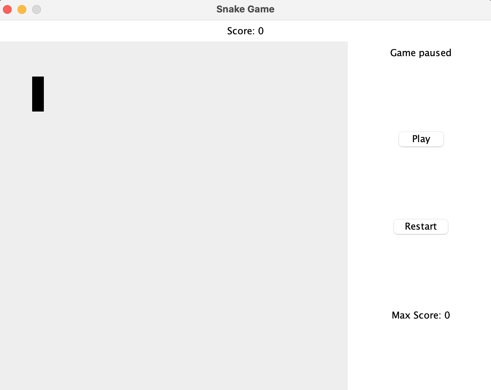

# Requisiti

\todo[color=purple]{manca screen gui implementata }

### Business

Creazione di un'applicativo che permetta di giocare a Snake implementando le meccaniche di base del gioco arcade. Il gioco deve essere implementato in modo da permettere a un singolo giocatore di controllare un serpente che si muove all'interno di una griglia. Il serpente deve crescere di dimensioni ogni volta che mangia del cibo, e il gioco termina se il serpente colpisce se stesso o i bordi della griglia.

### Modello di Dominio

Per la realizzazione del dominio, è stato preso come riferimento il gioco arcade originale, con parte delle sue regole ufficiali. Di seguito sarà riportata una descrizione più dettagliata del nostro dominio applicativo.

### Campo di Gioco

La mappa di gioco è composta da una griglia rettangolare di celle, ognuna delle quali rappresenta una posizione nel terreno di gioco. Il serpente si muove all'interno di questa griglia, cercando cibo e evitando collisioni con se stesso e con i bordi della griglia.

### Requisiti Funzionali

Per l'Utente:
1. L'utente deve poter interagire con l'applicazione tramite un'interfaccia grafica.
2. L'utente deve poter visualizzare il campo di gioco una volta iniziata la partita.
3. L'utente deve poter gestire il movimento del serpente utilizzando i controlli direzionali.
4. L'utente deve poter vedere il punteggio accumulato durante la partita.
5. L'utente deve poter visualizzare la lunghezza attuale del serpente.
6. L'utente deve poter visualizzare la posizione del cibo sulla mappa.
7. L'utente deve poter visualizzare il punteggio più alto mai raggiunto.
8. L'utente deve poter visualizzare lo stato del gioco (in corso, pausa, finito).
9. L'utente deve poter riavviare il gioco dopo che è finito.

Per il Sistema:
1. Il sistema deve poter gestire il movimento del serpente sulla mappa.
2. Il sistema deve poter generare casualmente la posizione del cibo sulla mappa con il vincolo che due mele occupino la stessa posizione.
3. Il sistema deve poter riconoscere quando il serpente mangia il cibo e aumentare la sua lunghezza.
4. Il sistema deve poter riconoscere la fine del gioco quando il serpente colpisce il bordo della mappa.
5. Il sistema deve poter riconoscere la fine del gioco quando il serpente collide con il proprio corpo.
6. Il sistema deve poter salvare automaticamente il punteggio più alto mai raggiunto.
7. Il sistema deve poter resettare il punteggio accumulato quando il gioco viene riavviato.

### Requisiti Non Funzionali
- **Usabilità:** l'interfaccia grafica deve essere semplice e intuitiva.
- **Affidabilità:** l'applicazione deve essere stabile, evitando crash.
- **Performance:** l'applicazione deve essere veloce e reattiva.
- **Portabilità:** l'applicazione deve essere disponibile su più piattaforme.
- **Manutenibilità:** il codice deve essere ben strutturato e facilmente manutenibile.

### Implementazione
- Utilizzo di:
    - Scala 3.3.0
    - ScalaTest 3.3.x
    - JDK 21

### Requisiti Opzionali
- **Punteggi e Classifiche:** fornire un sistema per tenere traccia dei punteggi più alti e mostrare una classifica.
- **Modalità Multiplayer Online:** implementare una modalità multiplayer online che consente a più giocatori di partecipare contemporaneamente.
- **Personalizzazione:** aggiungere opzioni per personalizzare l'aspetto del serpente e della mappa.
- **Livelli di Difficoltà:** aggiungere livelli di difficoltà per rendere il gioco più sfidante.
