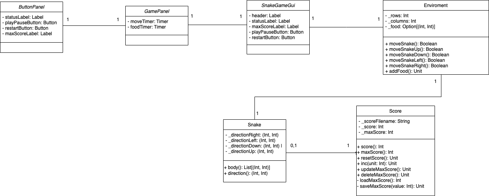

# Design di dettaglio

Questo capitolo illustra nel dettaglio il design del sistema SnakeScala. Il sistema si compone di 3 package i quali vengono discussi nei paragrafi che
seguono: `model`, `controller` e `view`.

# Model

Nella progettazione del gioco Snake, le classi `Snake` e `Score` giocano ruoli cruciali nel gestire rispettivamente il serpente e il punteggio. Qui di seguito esploreremo i dettagli del design implementativo di ciascuna classe e come interagiscono con l'ambiente di gioco rappresentato dalla classe `Environment`.

#### Classe Score

La classe `Score` gestisce il punteggio del giocatore, includendo la gestione del punteggio corrente e del punteggio massimo raggiunto, salvato su file. Ecco i dettagli salienti della sua implementazione:

- **Variabili di Stato**:
  - `_scoreFilename`: Nome del file in cui viene memorizzato il punteggio massimo.
  - `_score` e `_maxScore`: Rispettivamente il punteggio corrente e il punteggio massimo raggiunto.
  
- **Metodi Pubblici**:
  - `score()`: Restituisce il punteggio corrente del giocatore.
  - `maxScore()`: Restituisce il punteggio massimo raggiunto.
  - `resetScore()`: Resetta il punteggio corrente a zero.
  - `Inc(unit: Int)`: Incrementa il punteggio corrente del valore specificato.
  - `updateMaxScore()`: Aggiorna il punteggio massimo raggiunto se il punteggio corrente supera il massimo precedente, salvando il nuovo valore su file.
  - `deleteMaxScore()`: Cancella il file contenente il punteggio massimo.

- **Metodi Privati**:
  - `loadMaxScore()`: Carica il punteggio massimo dal file.
  - `saveMaxScore(value: Int)`: Salva il punteggio massimo nel file.

Questo design permette alla classe `Score` di gestire in modo sicuro e persistente il punteggio del giocatore, garantendo che il punteggio massimo venga conservato anche tra sessioni di gioco diverse.

#### Classe Snake

La classe `Snake` rappresenta il serpente nel gioco Snake, gestendo il suo corpo, direzione di movimento e interazione con l'ambiente di gioco. Ecco i dettagli del design implementativo:

- **Variabili di Stato**:
  - `_directionRight`, `_directionLeft`, `_directionDown`, `_directionUp`: Costanti che rappresentano le direzioni di movimento possibili del serpente.
  - `_isAlive`: Booleano che indica se il serpente è ancora vivo.
  - `_totalEatenFoods`: Contatore del numero di cibi mangiati dal serpente.
  - `_body`: Lista delle posizioni che compongono il corpo del serpente.
  - `_direction`: Direzione corrente di movimento del serpente.

- **Metodi Pubblici**:
  - `body()`: Restituisce la lista delle posizioni che compongono il corpo del serpente.
  - `direction()`: Restituisce la direzione corrente di movimento del serpente.
  - `totalEatenFoods()`: Restituisce il numero totale di cibi mangiati dal serpente.
  - Metodi `goUp()`, `goDown()`, `goLeft()`, `goRight()`: Impostano la direzione del serpente in una delle quattro direzioni consentite.
  - `move()`: Muove il serpente in base alla sua direzione corrente, gestendo collisioni con il cibo e i bordi della griglia. Restituisce `true` se il serpente è ancora vivo dopo il movimento, altrimenti `false`.

- **Metodi Privati**:
  - `changeDirection(newDir: (Int, Int))`: Cambia la direzione del serpente, controllando che il cambio sia consentito in base alla direzione attuale.

Questo design modulare della classe `Snake` consente un controllo preciso e una gestione sicura del movimento del serpente, interagendo con l'ambiente di gioco rappresentato dalla classe `Environment` per verificare collisioni con il cibo e i bordi.

### Interazione con l'Environment

Entrambe le classi `Snake` e `Score` interagiscono con l'ambiente di gioco (`Environment`) per aggiornare lo stato del gioco, gestendo il movimento del serpente, il conteggio dei punti e il salvataggio del punteggio massimo. Questo design garantisce una separazione chiara delle responsabilità e una gestione efficiente degli aspetti fondamentali del gioco Snake.

# View

In questo package sono presenti le classi che si occupano di costruire e gestire l'interfaccia utente del gioco Snake, in modo da garantire una corretta visualizzazione del gioco e delle informazioni. Queste classi sono progettate per reagire alle interazioni dell'utente con la GUI, richiamando le opportune funzioni dei controller per aggiornare lo stato del gioco.

Sono stati previsti diversi componenti principali per organizzare in maniera più ordinata i vari elementi che compongono la View:

### MainFrame

La classe principale `SnakeGameGui` estende `SimpleSwingApplication` e rappresenta il frame principale dell'applicazione. Al suo interno sono definiti vari componenti grafici e logiche di gestione del gioco:

- **Header**: Un'etichetta che visualizza il punteggio corrente del gioco.
- **Status Label**: Un'etichetta che mostra lo stato attuale del gioco, come "Game paused" o "Game Over".
- **Max Score Label**: Un'etichetta che visualizza il punteggio massimo raggiunto.
- **Play/Pause Button**: Un pulsante per avviare o mettere in pausa il gioco. Aggiorna lo stato del gioco e l'etichetta di stato.
- **Restart Button**: Un pulsante per riavviare il gioco. Resetta l'ambiente di gioco e riavvia i timer.

### Components

#### GamePanel

Il `GamePanel` è un componente chiave che estende `GridPanel`. Gestisce la logica di disegno e aggiornamento della griglia di gioco:

- **Movimento del Serpente**: Utilizza un `Timer` per gestire il movimento del serpente. Il serpente si muove automaticamente a intervalli regolari, e il movimento viene aggiornato basato sugli input dell'utente.
- **Generazione del Cibo**: Un altro `Timer` gestisce la generazione periodica del cibo nella griglia.
- **Disegno del Gioco**: Il metodo `paintComponent` è sovrascritto per disegnare il serpente e il cibo sulla griglia di gioco.
- **Gestione Input**: Il pannello ascolta gli eventi della tastiera per muovere il serpente in diverse direzioni (su, giù, sinistra, destra).

#### ButtonPanel

Il `ButtonPanel` è un componente verticale che contiene i pulsanti e le etichette di stato del gioco:

- **Status Label**: Visualizza lo stato attuale del gioco (in pausa, in corso, finito).
- **Play/Pause Button**: Permette di avviare e mettere in pausa il gioco. Aggiorna lo stato del gioco e l'etichetta di stato.
- **Restart Button**: Riavvia il gioco resettando l'ambiente e riavviando i timer.
- **Max Score Label**: Visualizza il punteggio massimo raggiunto durante il gioco.

### Logiche di Gioco

- **Gestione Stato del Gioco**: Il gioco inizia in stato di pausa. I pulsanti di play/pausa e riavvio permettono di gestire lo stato del gioco e i timer associati.
- **Movimento del Serpente e Collisioni**: La logica del movimento del serpente è gestita dal timer `moveTimer`. Se il serpente si muove senza collisioni, il gioco continua; altrimenti, lo stato viene aggiornato a "Game Over".
- **Aggiornamento del Punteggio**: Il punteggio viene aggiornato ogni volta che il serpente mangia il cibo. L'etichetta del punteggio viene aggiornata di conseguenza.

Questo design permette di realizzare un'interfaccia utente chiara e reattiva per il gioco Snake, garantendo una buona esperienza utente e facilitando la gestione dello stato del gioco tramite l'interazione con i componenti grafici.

# Controller
In questo package sono presenti le classi che si occupano di gestire le interazioni tra l'utente e il sistema, in modo da garantire la corretta esecuzione delle operazioni richieste.

Nel rispetto del pattern architetturale MVC, i controller sono stati progettati per reagire alle interazioni dell'utente con l'interfaccia grafica, per poi richiamare le opportune funzioni della logica di business.

I controllers relativi al gioco del serpente presentano una struttura ben precisa. Queste classi sono rappresentate da oggetti o classi che gestiscono specifiche operazioni del gioco, come il punteggio e il movimento del serpente.

Di seguito, vengono descritti i controllers presenti in questo package:

Il controller `Environment` gestisce la logica del gioco Snake, includendo la gestione del serpente, del cibo e del punteggio. Qui di seguito approfondiamo i dettagli del design implementativo per ciascuna componente del controller:

#### Struttura del Controller

Il controller `Environment` è progettato per mantenere lo stato e la logica del gioco Snake. Ecco una panoramica dei componenti principali:

- **Variabili di Stato**:
  - `_rows` e `_columns`: Rappresentano il numero di righe e colonne della griglia di gioco.
  - `_food`: Opzionale, rappresenta la posizione corrente del cibo sulla griglia.
  - `_rand`: Oggetto `Random` utilizzato per generare posizioni casuali.
  - `_snake`: Istanzia l'oggetto `Snake`, che rappresenta il serpente controllato dal giocatore.
  - `_score`: Gestisce il punteggio del giocatore e il punteggio massimo raggiunto.

#### Metodi Pubblici del Controller

- **Metodi Getter**:
  - `rows` e `columns`: Restituiscono rispettivamente il numero di righe e colonne della griglia di gioco.
  - `placedFood`: Restituisce la posizione del cibo, se presente.
  - `score` e `maxScore`: Restituiscono il punteggio corrente e il punteggio massimo raggiunto.
  - `totalEatenFoods`: Restituisce il numero totale di cibi mangiati dal serpente.
  - `snakeBody`: Restituisce la lista delle posizioni del corpo del serpente da disegnare sulla griglia.

- **Metodi per la Gestione del Cibo**:
  - `addFood()`: Aggiunge un cibo in una posizione casuale sulla griglia.
  - `addFood(place: (Int, Int))`: Aggiunge un cibo in una posizione specificata sulla griglia.
  - `tryEatFood(place: (Int, Int))`: Verifica se la posizione specificata contiene del cibo. Se sì, lo rimuove e aumenta il punteggio del giocatore.

- **Metodi per il Movimento del Serpente**:
  - `moveSnake()`: Muove il serpente sulla griglia. Restituisce `true` se il serpente è vivo dopo il movimento, altrimenti `false`.
  - Metodi separati (`moveSnakeUp()`, `moveSnakeDown()`, `moveSnakeLeft()`, `moveSnakeRight()`): Muovono il serpente in direzioni specifiche.

Questo design permette al controller di gestire efficacemente gli aspetti fondamentali del gioco Snake, garantendo una struttura modulare e ben organizzata per una facile manutenzione e espansione.

